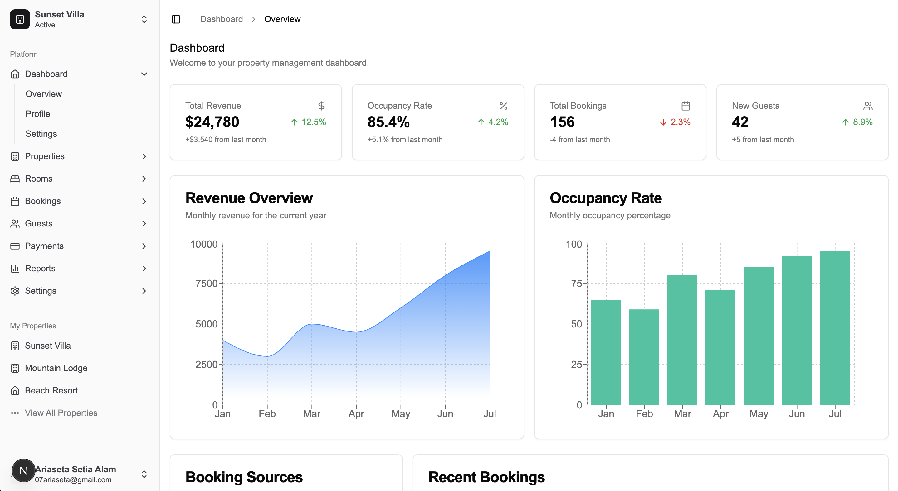

<p align="center">
  
</p>

<p align="center">
  <a href="LICENSE"></a>
  <a href="https://nextjs.org/"></a>
  <a href="https://react.dev/"></a>
  <a href="https://bun.sh/"></a>
  <a href="https://github.com/yourusername/pesan-pms/pulls"></a>
</p>

<p align="center">
  <strong>Pesan PMS</strong> is an open-source property management system designed to help manage hotels, homestays, villas, and other accommodation properties.
</p>

<p align="center">
  
</p>

## Features

- **Dashboard Overview**: Get a quick glance at your property's performance
- **Booking Management**: Handle reservations, check-ins, and check-outs
- **Guest Management**: Store and manage guest information
- **Room/Unit Management**: Track room availability and maintenance
- **Staff Management**: Manage staff schedules and permissions
- **Reporting**: Generate financial and occupancy reports
- **Multi-property Support**: Manage multiple properties from a single dashboard
- **Responsive Design**: Works on desktop, tablet, and mobile devices

## Roadmap

- [x] Authentication system
- [x] Dashboard UI with charts and reports
- [ ] Property setup wizard
- [ ] Room/unit inventory management
- [ ] Booking calendar
- [ ] Guest profiles
- [ ] Invoicing and payments
- [ ] Housekeeping management
- [ ] Maintenance tracking
- [ ] Channel manager integration
- [ ] API for third-party integrations
- [ ] Mobile app
- [ ] Multi-language support
- [ ] Dark mode

## Getting Started

There are two ways to use Pesan PMS:

1. Self-host the application
2. Contribute to the project development

## How to Self-Host

### Option 1: Using Bun (Recommended)

```bash
# Clone the repository
git clone https://github.com/yourusername/pesan-pms.git
cd pesan-pms

# Install dependencies
bun install

# Create environment file
cp .example.env .env

# Start the development server
bun run dev
```

After running these commands:

1. **Access the Application**:
   - Open [http://localhost:3000](http://localhost:3000) in your browser
   - The application should be running with hot-reloading enabled

2. **Building for Production**:
   ```bash
   # Build the application
   bun run build

   # Start the production server
   bun run start
   ```

### Option 2: Using Docker

Coming soon! We're working on Docker support for easier deployment.

## Contributing

We welcome contributions! Please see our [Contributing Guide](CONTRIBUTING.md) for details.

## Tech Stack

- **Framework**: [Next.js](https://nextjs.org/) (App Router)
- **Authentication**: [Better Auth](https://better-auth.com)
- **UI**: [Shadcn/UI](https://ui.shadcn.com/), [Radix UI](https://www.radix-ui.com/), [Tailwind CSS](https://tailwindcss.com)
- **State Management**: React Context API
- **Runtime & Package Manager**: [Bun](https://bun.sh/)

## License

This project is licensed under the MIT License - see the [LICENSE](LICENSE) file for details.

## Acknowledgments

- [shadcn/ui](https://ui.shadcn.com/) for the beautiful UI components
- [Radix UI](https://www.radix-ui.com/) for accessible UI primitives
- [Tailwind CSS](https://tailwindcss.com/) for the utility-first CSS framework
- [Next.js](https://nextjs.org/) for the React framework
- [Better Auth](https://better-auth.com) for the authentication system
- [Bun](https://bun.sh/) for the JavaScript runtime and package manager

##

<p align="center">Made with ❤️ by the Pesan PMS team</p>
